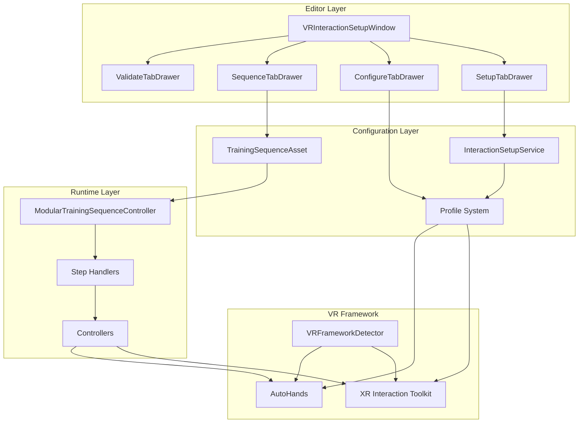
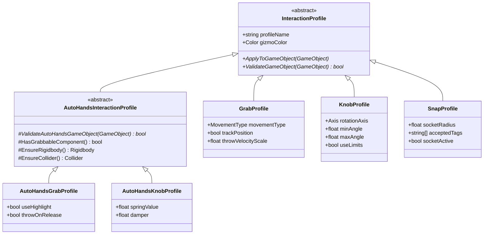
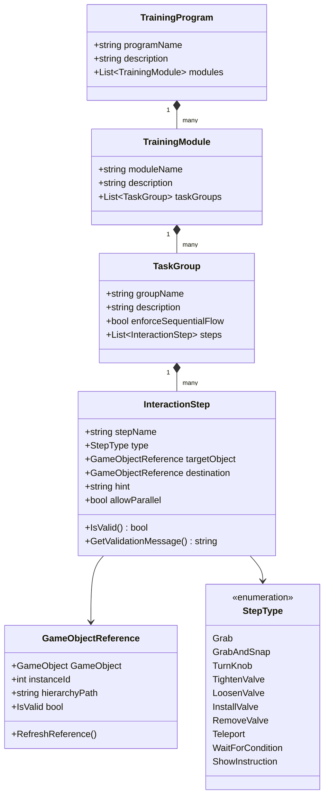
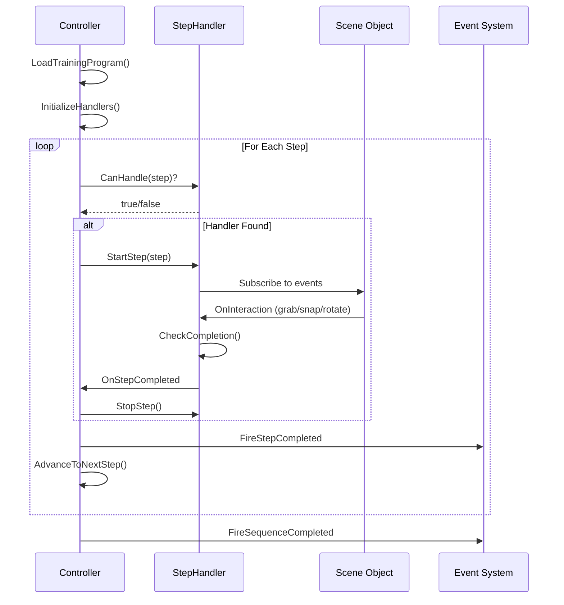
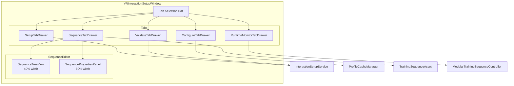

# VRTrainingKit Architecture

> A comprehensive guide to the VR Training Kit framework architecture for developers.

## Table of Contents
1. [Quick Reference](#quick-reference)
2. [System Overview](#system-overview)
3. [Architecture Layers](#architecture-layers)
4. [Mermaid Diagrams](#mermaid-diagrams)
5. [File Reference](#file-reference)
6. [Extension Points](#extension-points)

---

## Quick Reference

### ASCII Architecture Overview

```
┌─────────────────────────────────────────────────────────────────────────────┐
│                           VR TRAINING KIT                                    │
├─────────────────────────────────────────────────────────────────────────────┤
│                                                                              │
│   ┌─────────────────────────────────────────────────────────────────────┐   │
│   │                     EDITOR LAYER (Design Time)                       │   │
│   │  ┌─────────────┐  ┌──────────────┐  ┌──────────────┐  ┌───────────┐ │   │
│   │  │ Setup Tab   │  │ Configure Tab│  │ Sequence Tab │  │ Validate  │ │   │
│   │  │ (Scanning)  │  │ (Profiles)   │  │ (Builder)    │  │ Tab       │ │   │
│   │  └──────┬──────┘  └──────┬───────┘  └──────┬───────┘  └─────┬─────┘ │   │
│   │         │                │                 │                │        │   │
│   │         v                v                 v                v        │   │
│   │  ┌──────────────────────────────────────────────────────────────┐   │   │
│   │  │              VRInteractionSetupWindow (Main Editor)          │   │   │
│   │  └──────────────────────────────────────────────────────────────┘   │   │
│   └─────────────────────────────────────────────────────────────────────┘   │
│                                    │                                         │
│                                    v                                         │
│   ┌─────────────────────────────────────────────────────────────────────┐   │
│   │                     CONFIGURATION LAYER                              │   │
│   │  ┌────────────────┐    ┌────────────────┐    ┌──────────────────┐   │   │
│   │  │ InteractionSet-│    │ Profile System │    │ Training Sequence│   │   │
│   │  │ upService      │    │ (ScriptableObj)│    │ Asset            │   │   │
│   │  │  - ScanScene() │    │  - GrabProfile │    │  - TrainingProgram│  │   │
│   │  │  - ApplyComps()│    │  - KnobProfile │    │  - Modules       │   │   │
│   │  │  - Validate()  │    │  - SnapProfile │    │  - TaskGroups    │   │   │
│   │  └────────────────┘    │  - ValveProfile│    │  - Steps         │   │   │
│   │                        │  - ToolProfile │    └──────────────────┘   │   │
│   │                        └────────────────┘                            │   │
│   └─────────────────────────────────────────────────────────────────────┘   │
│                                    │                                         │
│                                    v                                         │
│   ┌─────────────────────────────────────────────────────────────────────┐   │
│   │                       RUNTIME LAYER                                  │   │
│   │  ┌─────────────────────────────────────────────────────────────┐    │   │
│   │  │         ModularTrainingSequenceController                    │    │   │
│   │  │  - Step progression   - Event dispatch   - Flow control      │    │   │
│   │  └─────────────────────────────────────────────────────────────┘    │   │
│   │                              │                                       │   │
│   │              ┌───────────────┼───────────────┐                      │   │
│   │              v               v               v                      │   │
│   │  ┌──────────────┐ ┌──────────────┐ ┌──────────────┐                │   │
│   │  │ Step Handlers│ │ Controllers  │ │ Validators   │                │   │
│   │  │ - GrabHandler│ │ - KnobCtrl   │ │ - SnapValid. │                │   │
│   │  │ - SnapHandler│ │ - ValveCtrl  │ │ - SequenceVal│                │   │
│   │  │ - KnobHandler│ │ - ToolCtrl   │ └──────────────┘                │   │
│   │  │ - ValveHandle│ │ - TeleportCtr│                                  │   │
│   │  └──────────────┘ └──────────────┘                                  │   │
│   └─────────────────────────────────────────────────────────────────────┘   │
│                                    │                                         │
│                                    v                                         │
│   ┌─────────────────────────────────────────────────────────────────────┐   │
│   │                    VR FRAMEWORK LAYER                                │   │
│   │  ┌──────────────────────┐    ┌──────────────────────┐               │   │
│   │  │   XR Interaction     │    │     AutoHands        │               │   │
│   │  │   Toolkit (XRI)      │    │     Framework        │               │   │
│   │  │  - XRGrabInteractable│    │  - Grabbable         │               │   │
│   │  │  - XRSocketInteractor│    │  - PlacePoint        │               │   │
│   │  └──────────────────────┘    └──────────────────────┘               │   │
│   │                    ^                    ^                            │   │
│   │                    └────────┬───────────┘                            │   │
│   │                             │                                        │   │
│   │                   ┌─────────────────────┐                            │   │
│   │                   │ VRFrameworkDetector │                            │   │
│   │                   │  - DetectFramework()│                            │   │
│   │                   │  - ValidateSetup()  │                            │   │
│   │                   └─────────────────────┘                            │   │
│   └─────────────────────────────────────────────────────────────────────┘   │
│                                                                              │
└─────────────────────────────────────────────────────────────────────────────┘
```

---

## System Overview

VRTrainingKit is a **modular, framework-agnostic** Unity system for creating VR training applications. It supports both XR Interaction Toolkit (XRI) and AutoHands frameworks.

### Core Concepts

| Concept | Description |
|---------|-------------|
| **Profile** | ScriptableObject defining how to configure an interaction (Grab, Knob, Snap, etc.) |
| **Step** | Single user action in a training sequence (grab object, turn knob, snap to socket) |
| **TaskGroup** | Collection of related steps that can be done in any order |
| **Module** | Major training section containing multiple task groups |
| **Program** | Complete training curriculum with multiple modules |

### Data Flow

```
User Tags Objects → Setup Assistant Scans → Profiles Configure Components
                                                      ↓
TrainingSequenceAsset ← Sequence Builder ← User Defines Steps
                                                      ↓
Runtime Controller ← Asset Loaded → Step Handlers Execute → Training Complete
```

---

## Architecture Layers

### Layer 1: Profile System

Defines **what components** to add and **how to configure** them.

```
Scripts/Profiles/
├── Base/
│   ├── InteractionProfile.cs          # Abstract base class
│   └── AutoHandsInteractionProfile.cs # AutoHands-specific base
└── Implementations/
    ├── GrabProfile.cs                  # XRGrabInteractable + Rigidbody + Collider
    ├── KnobProfile.cs                  # + HingeJoint + KnobController
    ├── SnapProfile.cs                  # XRSocketInteractor + SnapValidator
    ├── ToolProfile.cs                  # + ToolController
    ├── ValveProfile.cs                 # + ValveController
    └── AutoHands/
        ├── AutoHandsGrabProfile.cs
        ├── AutoHandsKnobProfile.cs
        ├── AutoHandsSnapProfile.cs
        ├── AutoHandsToolProfile.cs
        ├── AutoHandsValveProfile.cs
        └── AutoHandsTeleportProfile.cs
```

### Layer 2: Interaction Setup

Discovers tagged objects and applies profiles.

```
Scripts/Core/Services/
├── InteractionSetupService.cs    # Scene scanning, component application
└── InteractionLayerManager.cs    # XRI interaction layer management

Scripts/Core/Utilities/
├── VRFrameworkDetector.cs        # Detect XRI vs AutoHands
└── VRFrameworkManager.cs         # Framework configuration singleton
```

### Layer 3: Training Sequence System

Defines structured training workflows.

```
Scripts/SequenceSystem/
├── Data/
│   ├── TrainingSequence.cs       # Data classes: Program, Module, TaskGroup, Step
│   └── TrainingSequenceAsset.cs  # ScriptableObject wrapper with validation
├── Conditions/
│   ├── ISequenceCondition.cs     # Interface for custom conditions
│   ├── DummyCondition.cs         # Always-true test condition
│   └── [Custom conditions]
└── Validation/
    ├── SnapValidator.cs          # Socket validation with sequence events
    └── SequenceValidator.cs      # Step requirement validation
```

### Layer 4: Step Handler System

Executes individual training steps with framework awareness.

```
Scripts/StepHandlers/
├── Base/
│   ├── IStepHandler.cs           # Handler interface
│   ├── BaseStepHandler.cs        # Common functionality
│   ├── BaseXRIStepHandler.cs     # XRI-specific base
│   └── BaseAutoHandsStepHandler.cs # AutoHands-specific base
├── XRI/
│   ├── GrabStepHandler.cs
│   ├── SnapStepHandler.cs
│   ├── KnobStepHandler.cs
│   └── ValveStepHandler.cs
└── AutoHands/
    ├── AutoHandsGrabStepHandler.cs
    ├── AutoHandsSnapStepHandler.cs
    ├── AutoHandsKnobStepHandler.cs
    └── AutoHandsValveStepHandler.cs
```

### Layer 5: Sequence Controller

Orchestrates runtime training flow.

```
Scripts/Core/Controllers/
├── ModularTrainingSequenceController.cs  # Main runtime controller
├── SequenceFlowRestrictionManager.cs     # Sequential flow enforcement
├── KnobController.cs                     # Knob behavior (angle tracking, events)
├── ValveController.cs                    # Valve behavior (rotation, states)
├── ToolController.cs                     # Tool state machine
├── TeleportController.cs                 # Teleport mechanics
└── AutoHands/
    ├── AutoHandsKnobController.cs
    ├── AutoHandsValveController.cs
    └── AutoHandsValveControllerV2.cs
```

### Layer 6: Editor System

Visual tools for setup and sequence building.

```
Scripts/Editor/
├── Windows/
│   └── VRInteractionSetupWindow.cs       # Main editor window
├── UI/
│   ├── Core/
│   │   ├── VRTrainingEditorStyles.cs     # Centralized GUI styles
│   │   └── ProfileCacheManager.cs        # Profile caching for performance
│   ├── Tabs/
│   │   ├── SetupTabDrawer.cs             # Scene scanning tab
│   │   ├── ConfigureTabDrawer.cs         # Profile management tab
│   │   ├── SequenceTabDrawer.cs          # Sequence builder tab coordinator
│   │   ├── ValidateTabDrawer.cs          # Validation tab
│   │   └── RuntimeMonitorTabDrawer.cs    # Play mode debugging
│   └── SequenceEditor/
│       ├── SequenceTreeView.cs           # Hierarchical tree view
│       ├── SequencePropertiesPanel.cs    # Property editor with validation
│       └── ISequenceTreeViewCallbacks.cs # Callback interface
└── PropertyDrawers/
    └── GameObjectReferenceDrawer.cs      # Custom inspector for references
```

---

## Mermaid Diagrams

### High-Level Architecture



### Profile Inheritance Hierarchy



### Training Sequence Data Model



### Step Handler Flow



### Editor Window Structure



---

## File Reference

### Core Runtime Scripts

| File | Purpose | Key Methods |
|------|---------|-------------|
| `ModularTrainingSequenceController.cs` | Main sequence executor | `Initialize()`, `StartStep()`, `CompleteStep()` |
| `InteractionSetupService.cs` | Scene setup service | `ScanScene()`, `ApplyComponentsToObjects()`, `ValidateSetup()` |
| `VRFrameworkDetector.cs` | Framework detection | `DetectCurrentFramework()`, `ValidateFrameworkSetup()` |
| `TrainingSequence.cs` | Data structures | `TrainingProgram`, `TrainingModule`, `TaskGroup`, `InteractionStep` |
| `TrainingSequenceAsset.cs` | Asset wrapper | `ValidateProgram()`, `GetStats()` |

### Controllers

| File | Purpose | Key Properties |
|------|---------|----------------|
| `KnobController.cs` | Rotatable objects | `CurrentAngle`, `NormalizedValue`, `OnAngleChanged` |
| `ValveController.cs` | Valve interactions | `GetTotalRotationAngle()`, `OnValveTightened` |
| `ToolController.cs` | Tool state machine | `CurrentState`, `OnToolSnapped` |
| `TeleportController.cs` | Teleport mechanics | `enableRecentering`, `TeleportTo()` |

### Editor Scripts

| File | Purpose |
|------|---------|
| `VRInteractionSetupWindow.cs` | Main editor window (355 lines after refactor) |
| `SetupTabDrawer.cs` | Scene scanning and object configuration |
| `ConfigureTabDrawer.cs` | Profile selection and creation |
| `SequenceTabDrawer.cs` | Training sequence asset management |
| `SequenceTreeView.cs` | Hierarchical tree view for sequences |
| `SequencePropertiesPanel.cs` | Property editing with component validation |
| `VRTrainingEditorStyles.cs` | Centralized GUI styles |
| `ProfileCacheManager.cs` | Profile caching for performance |

---

## Extension Points

### Creating Custom Profiles

```csharp
[CreateAssetMenu(fileName = "CustomProfile", menuName = "VR Training/Custom Profile")]
public class CustomProfile : InteractionProfile
{
    public override void ApplyToGameObject(GameObject target)
    {
        // Add your components here
        var component = target.AddComponent<YourCustomComponent>();
        component.someProperty = yourSetting;
    }

    public override bool ValidateGameObject(GameObject target)
    {
        // Return true if object has required components
        return target.GetComponent<YourCustomComponent>() != null;
    }
}
```

### Creating Custom Step Handlers

```csharp
public class CustomStepHandler : BaseStepHandler
{
    public override bool CanHandle(InteractionStep step)
    {
        return step.type == InteractionStep.StepType.YourCustomType;
    }

    public override VRFramework SupportsFramework()
    {
        return VRFramework.AutoHands; // or XRI or Both
    }

    public override void StartStep(InteractionStep step)
    {
        // Subscribe to events, initialize tracking
    }

    public override void StopStep()
    {
        // Cleanup, unsubscribe from events
    }
}
```

### Creating Custom Sequence Conditions

```csharp
public class CustomCondition : MonoBehaviour, ISequenceCondition
{
    public bool IsMet()
    {
        // Return true when condition is satisfied
        return yourConditionLogic;
    }

    public void Reset()
    {
        // Reset condition state
    }
}
```

---

## Quick Start Guide

### For Scene Setup:
1. Tag your objects: `grab`, `knob`, `snap`, `valve`, `tool`, `teleportPoint`
2. Open `Sequence Builder > Setup Assistant`
3. Click `Scan Scene`
4. Select profiles in Configure tab
5. Click `Apply All Components`
6. Run validation to check for issues

### For Training Sequences:
1. Go to Sequence tab
2. Click `New` to create an asset
3. Add Modules → TaskGroups → Steps
4. Assign target objects and configure settings
5. Watch for validation warnings in the properties panel
6. Add `ModularTrainingSequenceController` to your scene
7. Assign the training asset and run

---

*Last updated: December 2025*
*VRTrainingKit version: 1.0*
